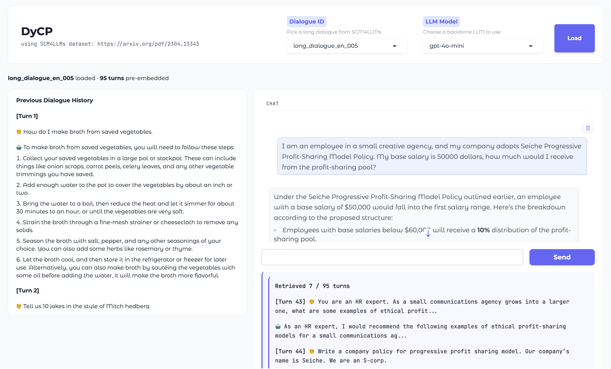

## DyCP: Dynamic Context Pruning for Long-Form Dialogue with LLMs
> [[Paper]](https://arxiv.org/abs/2601.07994) Nayoung Choi, Jonathan Zhang, Jinho D. Choi — Emory NLP Lab

### Overview
DyCP is a lightweight context management method for long-form dialogue with LLMs. It dynamically identifies and retrieves relevant dialogue segments conditioned on the current turn, with no offline memory construction and no extra LLM calls.

**Key properties:**
- ✅ No predefined topic boundaries
- ✅ Preserves sequential dialogue structure
- ✅ Single inference-time LLM call per query
- ✅ Plug-and-play: runs outside the LLM

### How It Works
DyCP pre-embeds each dialogue turn as it arrives. When a new user query comes in:
1. The query is embedded and compared against all pre-embedded previous turns
2. **KadaneDial** finds contiguous high-relevance spans
3. Only the selected segments are fed as context to the LLM

## Demo

- The demo uses the [SCM4LLMs dataset](https://github.com/wbbeyourself/scm4llms), which contains 10 long multi-topic dialogues. Select a dialogue and an LLM backend, then click Load. The full dialogue history is displayed and all turns are pre-embedded.
- You can then continue the conversation, with DyCP running in the background to retrieve only the relevant context at each turn. Sample test queries from SCM4LLMs appear as placeholders to help you get started.

### Installation
```bash
git clone --recurse-submodules https://github.com/emorynlp/DyCP.git
cd DyCP
pip install -r requirements.txt
```

### Quick Start
```bash
# Option 1: Pass keys as arguments
python run_demo.py --openai_api_key {OPENAI_API_KEY} --hf_token {HF_TOKEN}

# Option 2: Set environment variables
export OPENAI_API_KEY=sk-...
export HF_TOKEN=hf-...
python run_demo.py
```
